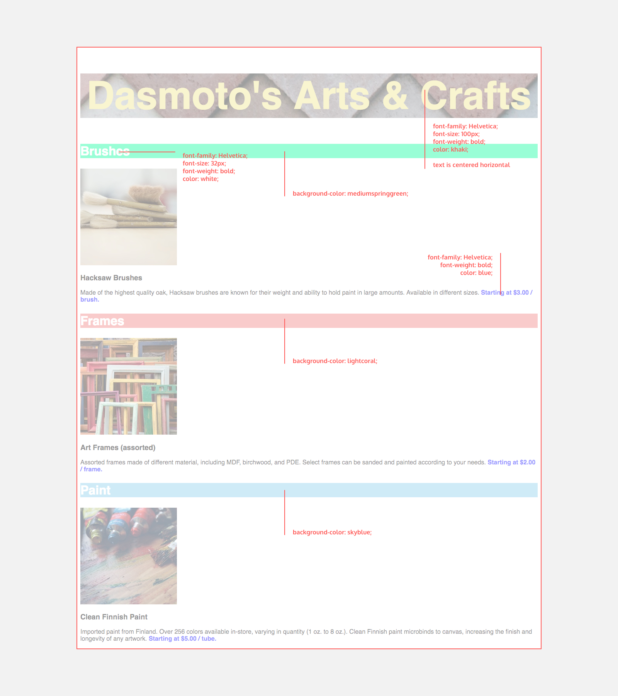

# Welcome to My Portfolio

My name is Alex and I am a ambitious web developer. I am currently working through projects with Code Academy, and currently enrolled in the Web developer tract. Below is a demonstration of the knowledge I have acquired through Code Academy, through the final projects in each section. Text in each code is provided by Code Academy, however the code for each project is coded by me. The projects in each course start from simple and devlop into more complex projects.

## Web Development

### HTML5 Demonstrations

  1. *Fashion Blog*
      This blog demostrates HTML5 basics of code
      
       [Fashion Blog Example](https://williamalexmorgan.github.io/MyCodeAcademyProjects/WebDevelopment/HTML/FashionBlogExample.html)
      
  2. *Wine Festival Schedule*
      Demonstrates use of HTML5 tables
      
        [Wine Festival Schedule](https://williamalexmorgan.github.io/MyCodeAcademyProjects/WebDevelopment/HTML/WineFestival/WineFestivalScheduleExample.html)
        
   3. *Form-a-Story*
        Demonstrates use of HTML5 forms and form validation
 
         [Form-a-Story](https://williamalexmorgan.github.io/MyCodeAcademyProjects/WebDevelopment/HTML/Form-a-Story/Form-a-Story.html)
         
### CSS Demonstrations

  1. *Healthy Recipe*
      Demonstrates the basic styles that CSS can implement with HTML5
      
        [Healthy Recipe](https://williamalexmorgan.github.io/MyCodeAcademyProjects/WebDevelopment/CSS/HealthyRecipe/Recipe.html)
        
  2. *Portfolio*
      Demonstrates the Visual Rules of CSS
      
        [Portfolio Example](https://williamalexmorgan.github.io/MyCodeAcademyProjects/WebDevelopment/CSS/Portfolio/Portfolio.html)
        
  3. *Arts & Crafts*
      This was set up like a job interview. The bottom image was given, and the following demonstration was produced.
      
      

         

  
        [Arts & Crafts Example](https://williamalexmorgan.github.io/MyCodeAcademyProjects/WebDevelopment/CSS/Arts&Crafts/Arts&Crafts.html) 
   
*I am constantly updating this page since this is a ongoing course, so please check back later
## Software Development
### Coming Soon!
## Data Science
### Coming Soon!
